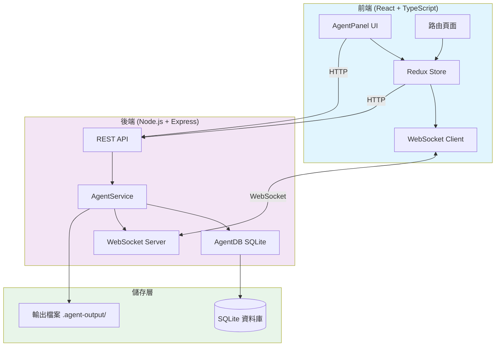
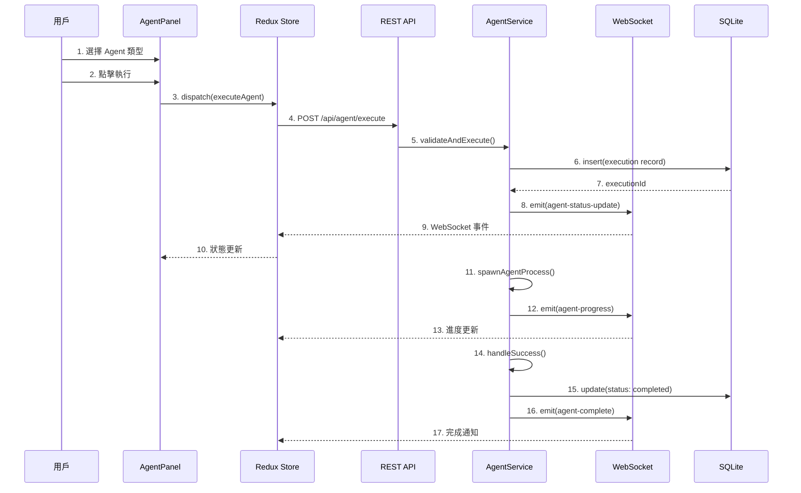
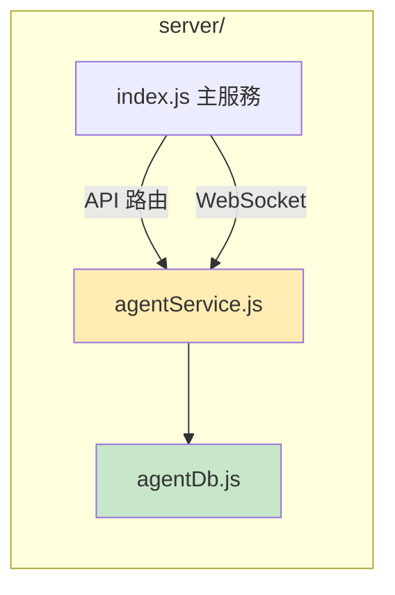
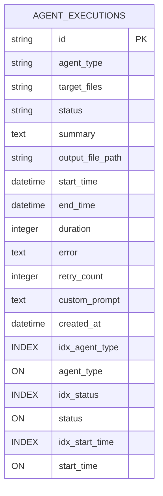
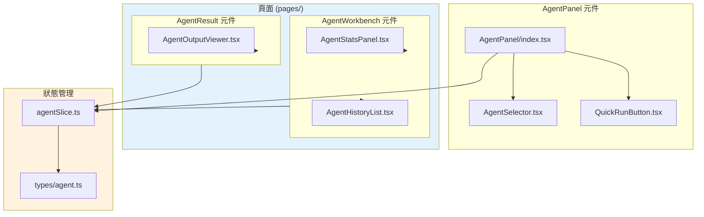
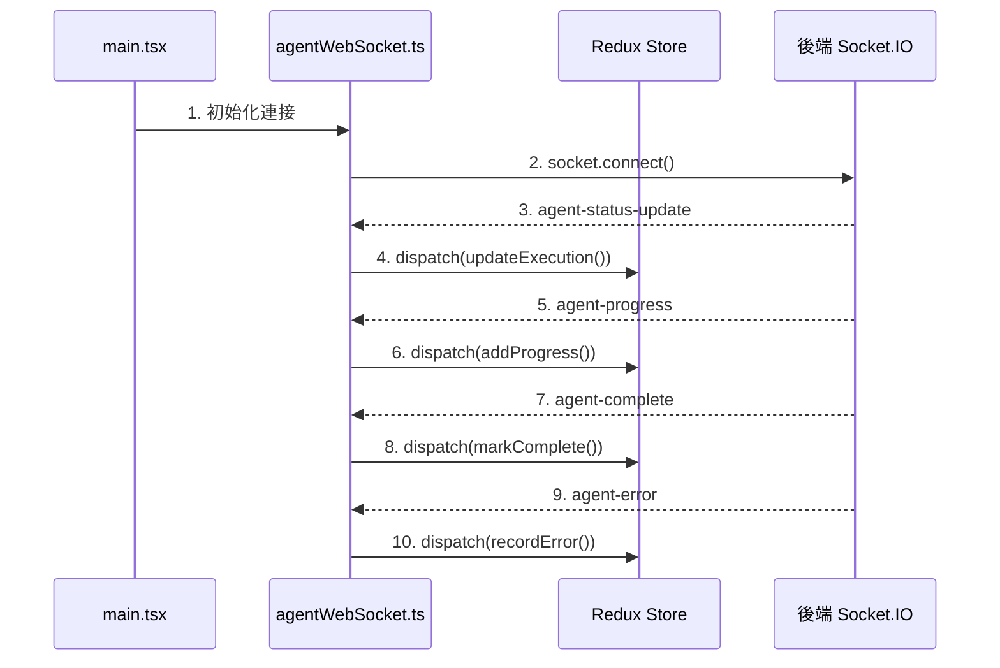
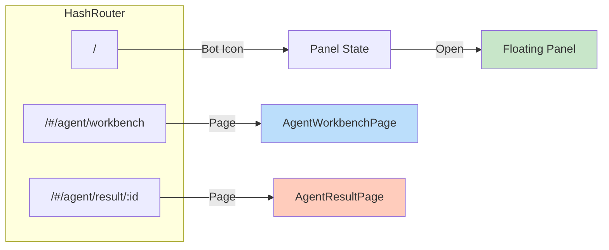
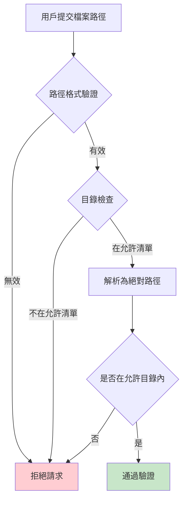

# Agent Panel 功能文件

## 概述

Agent Panel 是 CoSpec AI 的核心功能之一，提供整合式的 AI Agent 執行、監控和管理介面。用戶可以透過浮動面板快速執行不同類型的 AI Agent，並在工作台查看執行歷史和結果。

## 功能特色

### 1. 智能 Agent 類型
- **PRD Analyzer**：分析產品需求文件，提取關鍵資訊
- **Code Reviewer**：自動程式碼審查，檢測潛在問題
- **Doc Generator**：根據規格生成技術文件
- **Version Advisor**：版本建議和發布策略分析

### 2. 即時執行監控
- WebSocket 即時狀態更新
- 執行進度追蹤
- 自動重試機制（最多 3 次）

### 3. 歷史管理
- 執行記錄查詢與篩選
- 統計資訊儀表板
- 結果查看與匯出

## 系統架構

### 整體架構圖



### 資料流向圖



## 後端架構

### 模組結構



### API 端點

| 方法 | 端點 | 認證 | 說明 |
|------|-------|------|------|
| POST | /api/agent/execute | 必需 | 執行 Agent |
| GET | /api/agent/history | 選填 | 獲取執行歷史 |
| GET | /api/agent/history/:id | 選填 | 獲取單筆記錄 |
| DELETE | /api/agent/history/:id | 必需 | 刪除執行記錄 |

### 資料庫 Schema



#### 欄位說明

| 欄位 | 類型 | 說明 |
|------|------|------|
| id | TEXT PRIMARY KEY | 執行唯一識別碼 (UUID) |
| agent_type | TEXT NOT NULL | Agent 類型 (prd-analyzer, code-reviewer, doc-generator, version-advisor) |
| target_files | TEXT NOT NULL | 目標檔案路徑 (JSON 陣列字串) |
| status | TEXT NOT NULL | 執行狀態 (pending, running, completed, failed) |
| summary | TEXT | 執行摘要 |
| output_file_path | TEXT | 輸出檔案路徑 |
| start_time | TEXT NOT NULL | 開始時間 (ISO 8601) |
| end_time | TEXT | 結束時間 (ISO 8601) |
| duration | INTEGER | 執行時間（毫秒） |
| error | TEXT | 錯誤訊息 |
| retry_count | INTEGER DEFAULT 0 | 重試次數 |
| custom_prompt | TEXT | 自訂提示詞 |
| created_at | TEXT | 建立時間 |

## 前端架構

### 元件結構



### Redux 狀態結構

```mermaid
graph TD
    subgraph AgentState["AgentState"]
        executions[executions: AgentExecution[]]
        currentExecution[currentExecution: AgentExecution | null]
        stats[stats: AgentStats | null]
        isPanelOpen[isPanelOpen: boolean]
        filter[filter: FilterOptions]
        isLoading[isLoading: boolean]
        errorMessage[errorMessage: string | null]
    end

    subgraph Thunks["Async Thunks"]
        fetchHistory[fetchAgentHistory]
        executeAgent[executeAgent]
        deleteExecution[deleteAgentExecution]
    end

    subgraph Actions["Sync Actions"]
        togglePanel[togglePanel]
        setFilter[setFilter]
        updateExecution[updateExecution]
    end

    Thunks --> AgentState
    Actions --> AgentState

    style AgentState fill:#e8f5e9
    style Thunks fill:#fff9c4
    style Actions fill:#ffccbc
```

#### 類型定義

```typescript
// Agent 類型
type AgentType = 'prd-analyzer' | 'code-reviewer' | 'doc-generator' | 'version-advisor';

// 執行狀態
type ExecutionStatus = 'pending' | 'running' | 'completed' | 'failed';

// 執行記錄
interface AgentExecution {
  id: string;
  agentType: AgentType;
  targetFiles: string[];
  status: ExecutionStatus;
  summary?: string;
  outputFilePath?: string;
  startTime: string;
  endTime?: string;
  duration?: number;
  error?: string;
  retryCount: number;
  customPrompt?: string;
}

// 統計資訊
interface AgentStats {
  totalExecutions: number;
  successfulExecutions: number;
  failedExecutions: number;
  averageDuration: number;
  byAgentType: Record<AgentType, number>;
}

// 篩選選項
interface FilterOptions {
  agentType?: AgentType;
  status?: ExecutionStatus;
  dateRange?: { start: string; end: string };
  searchQuery?: string;
}
```

### WebSocket 整合



## 路由結構



## 安全性設計

### 檔案路徑驗證



### 允許的目錄

- `MARKDOWN_DIR` 環境變數指定的目錄
- `./specs/` - 規格文件目錄
- `./docs/` - 文件目錄

### API 認證

所有寫入操作需要 Bearer Token：

```bash
Authorization: Bearer ${API_KEY}
```

## 開發指南

### 新增 Agent 類型

1. **更新類型定義** (`types/agent.ts`)：
```typescript
type AgentType = 'prd-analyzer' | 'code-reviewer' | 'doc-generator' | 'version-advisor' | 'your-new-agent';
```

2. **更新後端執行邏輯** (`agentService.js`)：
```javascript
case 'your-new-agent':
  return executeYourNewAgent(targetFiles, options);
```

3. **更新前端選擇器** (`AgentSelector.tsx`)：
```typescript
const AGENT_TYPES: AgentType[] = [
  // ... existing agents
  'your-new-agent',
];
```

### 擴展輸出格式

在 `agentService.js` 中添加新的輸出格式處理：

```javascript
function generateOutput(agentType, result) {
  switch (agentType) {
    case 'doc-generator':
      return {
        format: 'markdown',
        content: result.markdown
      };
    // ... 其他格式
  }
}
```

## 測試

### 單元測試

```bash
# 後端測試
cd server
npm test

# 前端測試
cd app-react
npm test
```

### 整合測試

```bash
# 端到端測試
npm run test:e2e
```

## 部署

### 環境變數

```bash
# Agent 配置
AGENT_MAX_RETRIES=3
AGENT_TIMEOUT=300000
AGENT_OUTPUT_DIR=.agent-output

# SQLite 配置
AGENT_DB_PATH=.agent-data/executions.db
```

### Docker 部署

```yaml
# docker-compose.yml
services:
  app:
    volumes:
      - ./markdown:/markdown
      - ./.agent-output:/app/.agent-output
      - ./.agent-data:/app/.agent-data
```

## 故障排除

### 常見問題

| 問題 | 原因 | 解決方案 |
|------|------|----------|
| Agent 執行失敗 | 檔案路徑無效 | 檢查檔案是否在允許目錄內 |
| WebSocket 連接失敗 | CORS 設定錯誤 | 檢查 server/index.js 的 CORS 配置 |
| 歷史記錄不顯示 | 資料庫連接問題 | 檢查 SQLite 檔案權限 |
| 進度更新不即時 | WebSocket 斷線 | 重新整理頁面重建連接 |

## 未來規劃

### Phase 2 功能

- [ ] Agent SDK 整合（目前使用模擬執行）
- [ ] 進階配置選項
- [ ] 結果 PDF 匯出
- [ ] 批次執行支援
- [ ] 自訂 Agent 編輯器

### Phase 3 功能

- [ ] Agent 模組市集
- [ ] 協作執行模式
- [ ] 執行排程功能
- [ ] 效能分析儀表板

---

**文件版本**: 1.0.0
**最後更新**: 2026-02-13
**維護者**: CoSpec AI Team

## 相關文件

- [Agent Panel 設計文件](../plans/2026-02-13-agent-panel-design.md)
- [Agent Panel 實作計劃](../plans/2026-02-13-agent-panel-implementation.md)
