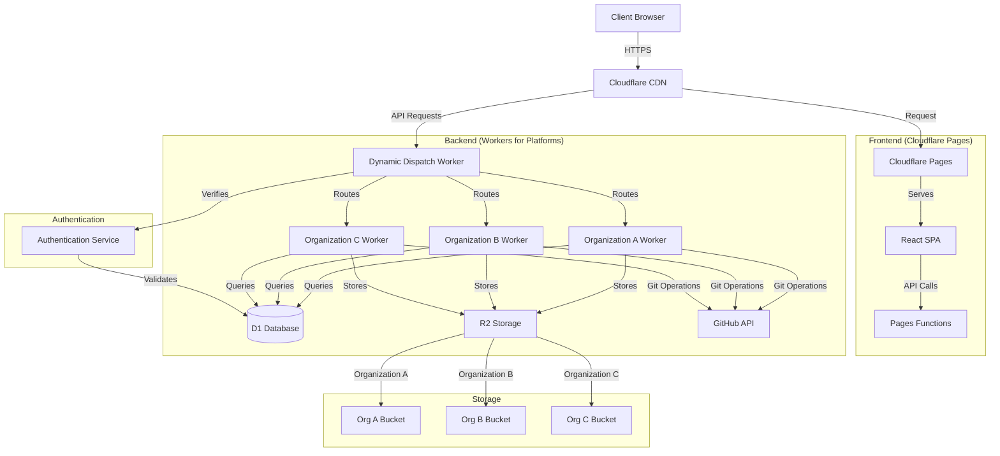
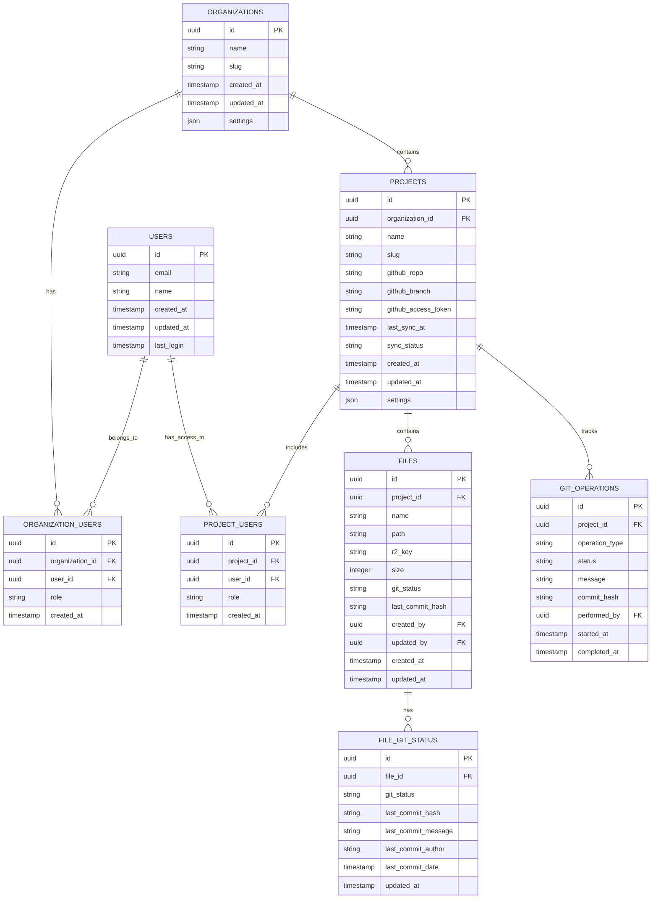
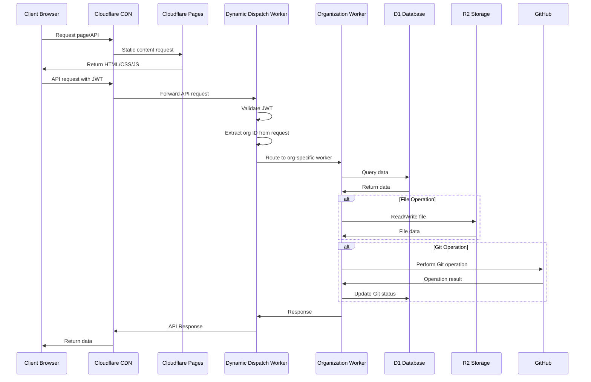
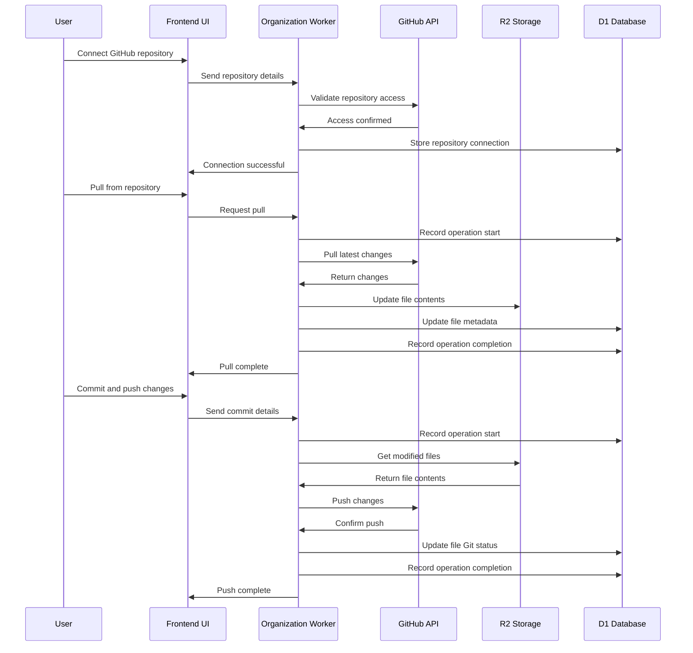
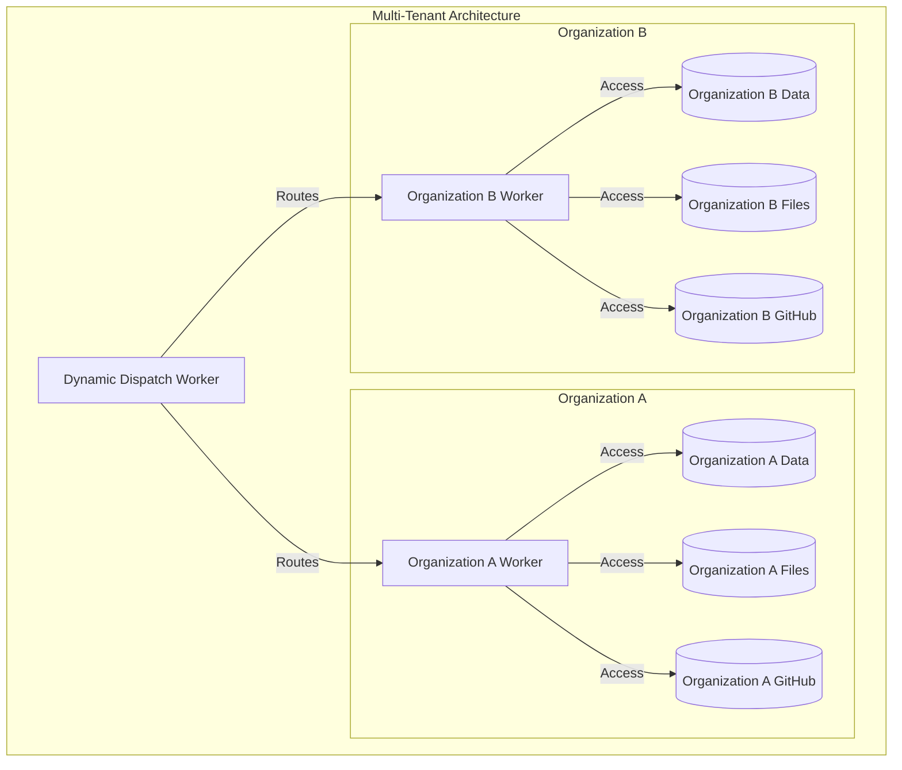

# Vditor SaaS Architecture Diagram

## System Architecture

```mermaid
graph TD
    Client[Client Browser] -->|HTTPS| CF[Cloudflare CDN]
    CF -->|Request| Pages[Cloudflare Pages]
    CF -->|API Requests| DDW[Dynamic Dispatch Worker]
    
    subgraph "Frontend (Cloudflare Pages)"
        Pages -->|Serves| React[React SPA]
        React -->|API Calls| PF[Pages Functions]
    end
    
    subgraph "Backend (Workers for Platforms)"
        DDW -->|Routes| OrgA[Organization A Worker]
        DDW -->|Routes| OrgB[Organization B Worker]
        DDW -->|Routes| OrgC[Organization C Worker]
        
        OrgA -->|Queries| D1DB[(D1 Database)]
        OrgB -->|Queries| D1DB
        OrgC -->|Queries| D1DB
        
        OrgA -->|Stores| R2[R2 Storage]
        OrgB -->|Stores| R2
        OrgC -->|Stores| R2
        
        OrgA -->|Git Operations| GitHub[GitHub API]
        OrgB -->|Git Operations| GitHub
        OrgC -->|Git Operations| GitHub
    end
    
    subgraph "Authentication"
        DDW -->|Verifies| Auth[Authentication Service]
        Auth -->|Validates| D1DB
    end
    
    subgraph "Storage"
        R2 -->|Organization A| OrgABucket[Org A Bucket]
        R2 -->|Organization B| OrgBBucket[Org B Bucket]
        R2 -->|Organization C| OrgCBucket[Org C Bucket]
    end
```

## Data Model

```mermaid
erDiagram
    ORGANIZATIONS ||--o{ PROJECTS : contains
    ORGANIZATIONS ||--o{ ORGANIZATION_USERS : has
    USERS ||--o{ ORGANIZATION_USERS : belongs_to
    USERS ||--o{ PROJECT_USERS : has_access_to
    PROJECTS ||--o{ PROJECT_USERS : includes
    PROJECTS ||--o{ FILES : contains
    PROJECTS ||--o{ GIT_OPERATIONS : tracks
    FILES ||--o{ FILE_GIT_STATUS : has
    
    ORGANIZATIONS {
        uuid id PK
        string name
        string slug
        timestamp created_at
        timestamp updated_at
        json settings
    }
    
    PROJECTS {
        uuid id PK
        uuid organization_id FK
        string name
        string slug
        string github_repo
        string github_branch
        string github_access_token
        timestamp last_sync_at
        string sync_status
        timestamp created_at
        timestamp updated_at
        json settings
    }
    
    USERS {
        uuid id PK
        string email
        string name
        timestamp created_at
        timestamp updated_at
        timestamp last_login
    }
    
    ORGANIZATION_USERS {
        uuid id PK
        uuid organization_id FK
        uuid user_id FK
        string role
        timestamp created_at
    }
    
    PROJECT_USERS {
        uuid id PK
        uuid project_id FK
        uuid user_id FK
        string role
        timestamp created_at
    }
    
    FILES {
        uuid id PK
        uuid project_id FK
        string name
        string path
        string r2_key
        integer size
        string git_status
        string last_commit_hash
        uuid created_by FK
        uuid updated_by FK
        timestamp created_at
        timestamp updated_at
    }
    
    GIT_OPERATIONS {
        uuid id PK
        uuid project_id FK
        string operation_type
        string status
        string message
        string commit_hash
        uuid performed_by FK
        timestamp started_at
        timestamp completed_at
    }
    
    FILE_GIT_STATUS {
        uuid id PK
        uuid file_id FK
        string git_status
        string last_commit_hash
        string last_commit_message
        string last_commit_author
        timestamp last_commit_date
        timestamp updated_at
    }
```

## Request Flow

```mermaid
sequenceDiagram
    participant Client as Client Browser
    participant CDN as Cloudflare CDN
    participant Pages as Cloudflare Pages
    participant DDW as Dynamic Dispatch Worker
    participant OrgWorker as Organization Worker
    participant D1 as D1 Database
    participant R2 as R2 Storage
    
    Client->>CDN: Request page/API
    CDN->>Pages: Static content request
    Pages->>Client: Return HTML/CSS/JS
    
    Client->>CDN: API request with JWT
    CDN->>DDW: Forward API request
    DDW->>DDW: Validate JWT
    DDW->>DDW: Extract org ID from request
    DDW->>OrgWorker: Route to org-specific worker
    
    OrgWorker->>D1: Query data
    D1->>OrgWorker: Return data
    
    alt File Operation
        OrgWorker->>R2: Read/Write file
        R2->>OrgWorker: File data
    end
    
    alt Git Operation
        OrgWorker->>GitHub: Perform Git operation
        GitHub->>OrgWorker: Operation result
        OrgWorker->>D1: Update Git status
    end
    
    OrgWorker->>DDW: Response
    DDW->>CDN: API Response
    CDN->>Client: Return data
```

## GitHub Integration Flow

```mermaid
sequenceDiagram
    participant User as User
    participant UI as Frontend UI
    participant Worker as Organization Worker
    participant GitHub as GitHub API
    participant R2 as R2 Storage
    participant D1 as D1 Database
    
    %% Connect Repository
    User->>UI: Connect GitHub repository
    UI->>Worker: Send repository details
    Worker->>GitHub: Validate repository access
    GitHub->>Worker: Access confirmed
    Worker->>D1: Store repository connection
    Worker->>UI: Connection successful
    
    %% Pull Operation
    User->>UI: Pull from repository
    UI->>Worker: Request pull
    Worker->>D1: Record operation start
    Worker->>GitHub: Pull latest changes
    GitHub->>Worker: Return changes
    Worker->>R2: Update file contents
    Worker->>D1: Update file metadata
    Worker->>D1: Record operation completion
    Worker->>UI: Pull complete
    
    %% Commit and Push Operation
    User->>UI: Commit and push changes
    UI->>Worker: Send commit details
    Worker->>D1: Record operation start
    Worker->>R2: Get modified files
    R2->>Worker: Return file contents
    Worker->>GitHub: Push changes
    GitHub->>Worker: Confirm push
    Worker->>D1: Update file Git status
    Worker->>D1: Record operation completion
    Worker->>UI: Push complete
```

## Multi-Tenant Isolation

```mermaid
graph TD
    subgraph "Multi-Tenant Architecture"
        DDW[Dynamic Dispatch Worker]
        
        subgraph "Organization A"
            OrgA[Organization A Worker]
            OrgAData[(Organization A Data)]
            OrgAFiles[(Organization A Files)]
            OrgAGit[(Organization A GitHub)]
        end
        
        subgraph "Organization B"
            OrgB[Organization B Worker]
            OrgBData[(Organization B Data)]
            OrgBFiles[(Organization B Files)]
            OrgBGit[(Organization B GitHub)]
        end
        
        DDW -->|Routes| OrgA
        DDW -->|Routes| OrgB
        
        OrgA -->|Access| OrgAData
        OrgA -->|Access| OrgAFiles
        OrgA -->|Access| OrgAGit
        
        OrgB -->|Access| OrgBData
        OrgB -->|Access| OrgBFiles
        OrgB -->|Access| OrgBGit
    end
```
