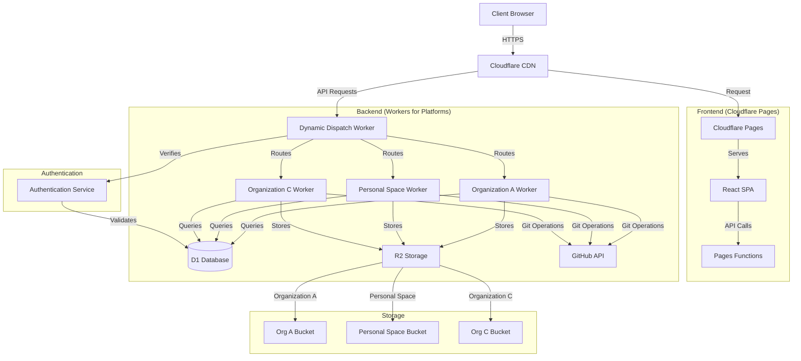
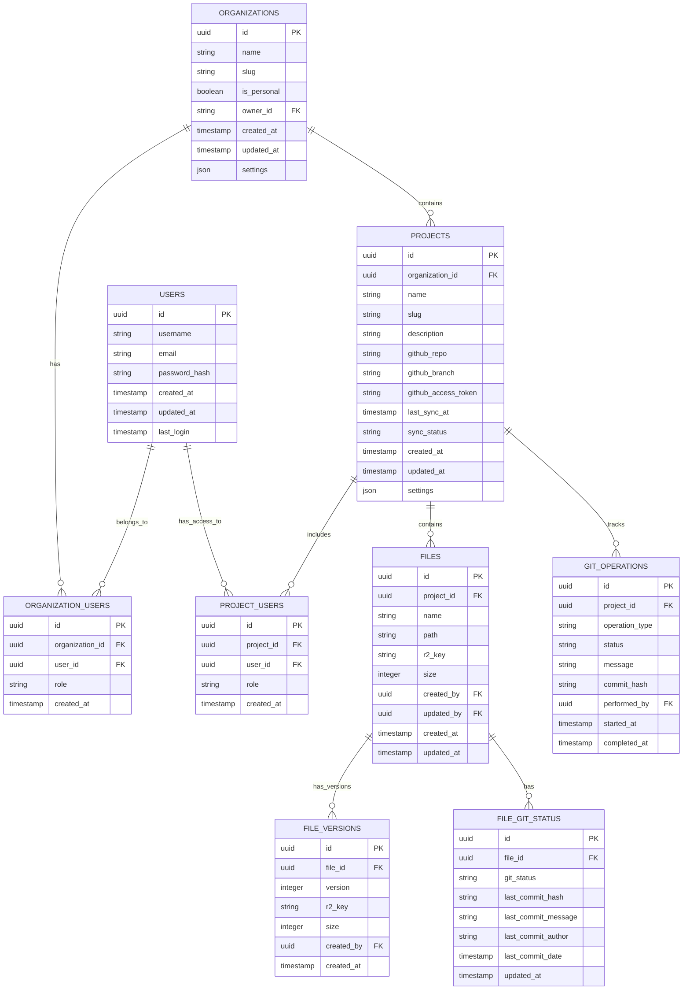
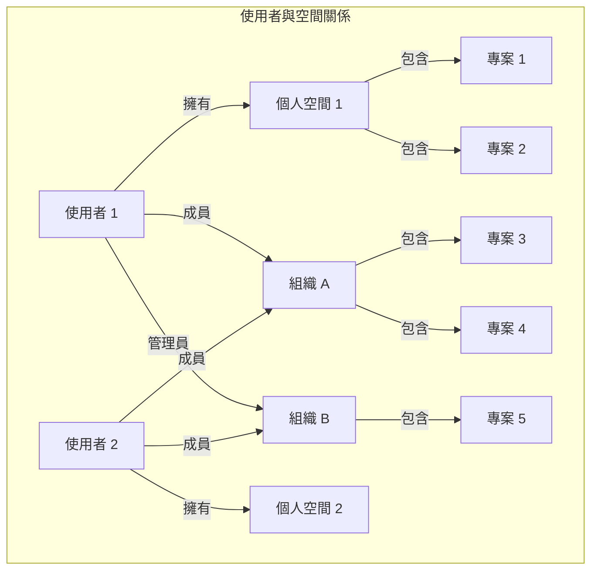
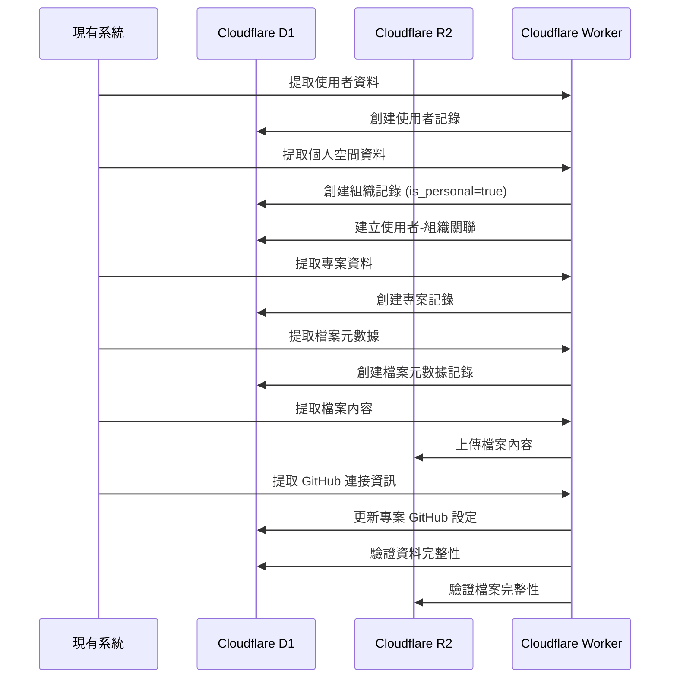
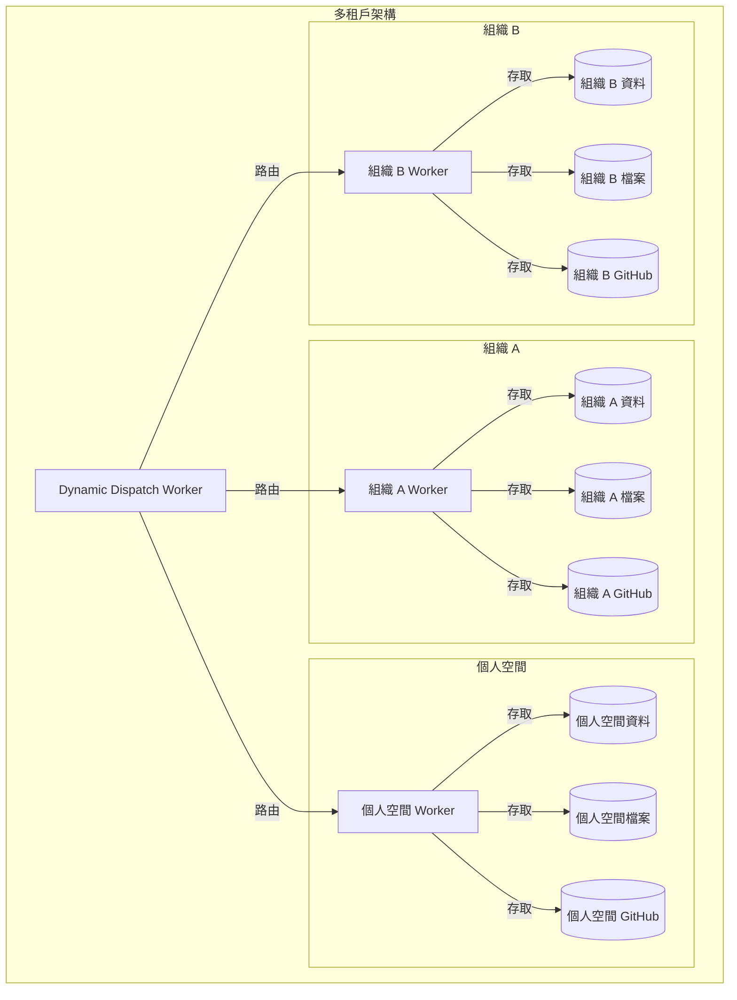
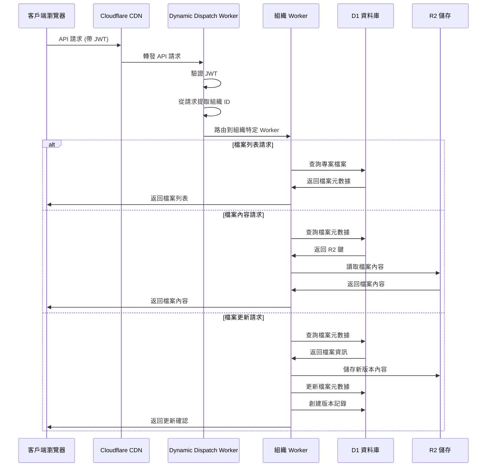
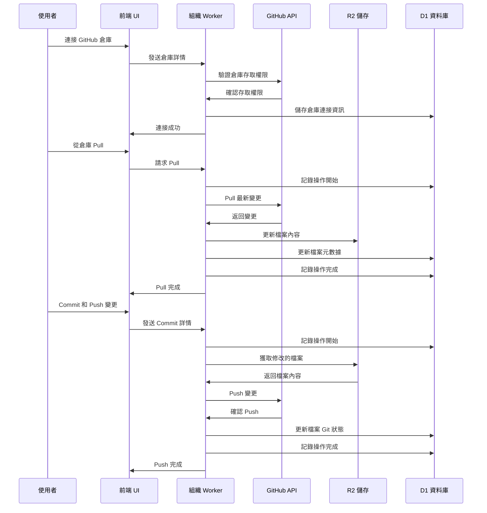

# CoSpec SaaS 更新架構圖

## 系統架構

```mermaid
graph TD
    Client[Client Browser] -->|HTTPS| CF[Cloudflare CDN]
    CF -->|Request| Pages[Cloudflare Pages]
    CF -->|API Requests| DDW[Dynamic Dispatch Worker]
    
    subgraph "Frontend (Cloudflare Pages)"
        Pages -->|Serves| React[React SPA]
        React -->|API Calls| PF[Pages Functions]
    end
    
    subgraph "Backend (Workers for Platforms)"
        DDW -->|Routes| OrgA[Organization A Worker]
        DDW -->|Routes| OrgB[Personal Space Worker]
        DDW -->|Routes| OrgC[Organization C Worker]
        
        OrgA -->|Queries| D1DB[(D1 Database)]
        OrgB -->|Queries| D1DB
        OrgC -->|Queries| D1DB
        
        OrgA -->|Stores| R2[R2 Storage]
        OrgB -->|Stores| R2
        OrgC -->|Stores| R2
        
        OrgA -->|Git Operations| GitHub[GitHub API]
        OrgB -->|Git Operations| GitHub
        OrgC -->|Git Operations| GitHub
    end
    
    subgraph "Authentication"
        DDW -->|Verifies| Auth[Authentication Service]
        Auth -->|Validates| D1DB
    end
    
    subgraph "Storage"
        R2 -->|Organization A| OrgABucket[Org A Bucket]
        R2 -->|Personal Space| OrgBBucket[Personal Space Bucket]
        R2 -->|Organization C| OrgCBucket[Org C Bucket]
    end
```

## 更新資料模型

```mermaid
erDiagram
    ORGANIZATIONS ||--o{ PROJECTS : contains
    ORGANIZATIONS ||--o{ ORGANIZATION_USERS : has
    USERS ||--o{ ORGANIZATION_USERS : belongs_to
    USERS ||--o{ PROJECT_USERS : has_access_to
    PROJECTS ||--o{ PROJECT_USERS : includes
    PROJECTS ||--o{ FILES : contains
    PROJECTS ||--o{ GIT_OPERATIONS : tracks
    FILES ||--o{ FILE_VERSIONS : has_versions
    FILES ||--o{ FILE_GIT_STATUS : has
    
    ORGANIZATIONS {
        uuid id PK
        string name
        string slug
        boolean is_personal
        string owner_id FK
        timestamp created_at
        timestamp updated_at
        json settings
    }
    
    PROJECTS {
        uuid id PK
        uuid organization_id FK
        string name
        string slug
        string description
        string github_repo
        string github_branch
        string github_access_token
        timestamp last_sync_at
        string sync_status
        timestamp created_at
        timestamp updated_at
        json settings
    }
    
    USERS {
        uuid id PK
        string username
        string email
        string password_hash
        timestamp created_at
        timestamp updated_at
        timestamp last_login
    }
    
    ORGANIZATION_USERS {
        uuid id PK
        uuid organization_id FK
        uuid user_id FK
        string role
        timestamp created_at
    }
    
    PROJECT_USERS {
        uuid id PK
        uuid project_id FK
        uuid user_id FK
        string role
        timestamp created_at
    }
    
    FILES {
        uuid id PK
        uuid project_id FK
        string name
        string path
        string r2_key
        integer size
        uuid created_by FK
        uuid updated_by FK
        timestamp created_at
        timestamp updated_at
    }
    
    FILE_VERSIONS {
        uuid id PK
        uuid file_id FK
        integer version
        string r2_key
        integer size
        uuid created_by FK
        timestamp created_at
    }
    
    GIT_OPERATIONS {
        uuid id PK
        uuid project_id FK
        string operation_type
        string status
        string message
        string commit_hash
        uuid performed_by FK
        timestamp started_at
        timestamp completed_at
    }
    
    FILE_GIT_STATUS {
        uuid id PK
        uuid file_id FK
        string git_status
        string last_commit_hash
        string last_commit_message
        string last_commit_author
        timestamp last_commit_date
        timestamp updated_at
    }
```

## 個人空間與組織關係

```mermaid
graph TD
    subgraph "使用者與空間關係"
        User1[使用者 1] -->|擁有| PS1[個人空間 1]
        User1 -->|成員| Org1[組織 A]
        User1 -->|管理員| Org2[組織 B]
        
        User2[使用者 2] -->|擁有| PS2[個人空間 2]
        User2 -->|成員| Org1
        User2 -->|成員| Org2
        
        PS1 -->|包含| Proj1[專案 1]
        PS1 -->|包含| Proj2[專案 2]
        
        Org1 -->|包含| Proj3[專案 3]
        Org1 -->|包含| Proj4[專案 4]
        
        Org2 -->|包含| Proj5[專案 5]
    end
```

## 資料遷移流程

```mermaid
sequenceDiagram
    participant Source as 現有系統
    participant D1 as Cloudflare D1
    participant R2 as Cloudflare R2
    participant Worker as Cloudflare Worker
    
    Source->>Worker: 提取使用者資料
    Worker->>D1: 創建使用者記錄
    
    Source->>Worker: 提取個人空間資料
    Worker->>D1: 創建組織記錄 (is_personal=true)
    Worker->>D1: 建立使用者-組織關聯
    
    Source->>Worker: 提取專案資料
    Worker->>D1: 創建專案記錄
    
    Source->>Worker: 提取檔案元數據
    Worker->>D1: 創建檔案元數據記錄
    
    Source->>Worker: 提取檔案內容
    Worker->>R2: 上傳檔案內容
    
    Source->>Worker: 提取 GitHub 連接資訊
    Worker->>D1: 更新專案 GitHub 設定
    
    Worker->>D1: 驗證資料完整性
    Worker->>R2: 驗證檔案完整性
```

## 多租戶隔離

```mermaid
graph TD
    subgraph "多租戶架構"
        DDW[Dynamic Dispatch Worker]
        
        subgraph "組織 A"
            OrgA[組織 A Worker]
            OrgAData[(組織 A 資料)]
            OrgAFiles[(組織 A 檔案)]
            OrgAGit[(組織 A GitHub)]
        end
        
        subgraph "個人空間"
            PS[個人空間 Worker]
            PSData[(個人空間資料)]
            PSFiles[(個人空間檔案)]
            PSGit[(個人空間 GitHub)]
        end
        
        subgraph "組織 B"
            OrgB[組織 B Worker]
            OrgBData[(組織 B 資料)]
            OrgBFiles[(組織 B 檔案)]
            OrgBGit[(組織 B GitHub)]
        end
        
        DDW -->|路由| OrgA
        DDW -->|路由| PS
        DDW -->|路由| OrgB
        
        OrgA -->|存取| OrgAData
        OrgA -->|存取| OrgAFiles
        OrgA -->|存取| OrgAGit
        
        PS -->|存取| PSData
        PS -->|存取| PSFiles
        PS -->|存取| PSGit
        
        OrgB -->|存取| OrgBData
        OrgB -->|存取| OrgBFiles
        OrgB -->|存取| OrgBGit
    end
```

## 資料存取流程

```mermaid
sequenceDiagram
    participant Client as 客戶端瀏覽器
    participant CDN as Cloudflare CDN
    participant DDW as Dynamic Dispatch Worker
    participant OrgWorker as 組織 Worker
    participant D1 as D1 資料庫
    participant R2 as R2 儲存
    
    Client->>CDN: API 請求 (帶 JWT)
    CDN->>DDW: 轉發 API 請求
    DDW->>DDW: 驗證 JWT
    DDW->>DDW: 從請求提取組織 ID
    DDW->>OrgWorker: 路由到組織特定 Worker
    
    alt 檔案列表請求
        OrgWorker->>D1: 查詢專案檔案
        D1->>OrgWorker: 返回檔案元數據
        OrgWorker->>Client: 返回檔案列表
    else 檔案內容請求
        OrgWorker->>D1: 查詢檔案元數據
        D1->>OrgWorker: 返回 R2 鍵
        OrgWorker->>R2: 讀取檔案內容
        R2->>OrgWorker: 返回檔案內容
        OrgWorker->>Client: 返回檔案內容
    else 檔案更新請求
        OrgWorker->>D1: 查詢檔案元數據
        D1->>OrgWorker: 返回檔案資訊
        OrgWorker->>R2: 儲存新版本內容
        OrgWorker->>D1: 更新檔案元數據
        OrgWorker->>D1: 創建版本記錄
        OrgWorker->>Client: 返回更新確認
    end
```

## GitHub 整合流程

```mermaid
sequenceDiagram
    participant User as 使用者
    participant UI as 前端 UI
    participant Worker as 組織 Worker
    participant GitHub as GitHub API
    participant R2 as R2 儲存
    participant D1 as D1 資料庫
    
    %% 連接倉庫
    User->>UI: 連接 GitHub 倉庫
    UI->>Worker: 發送倉庫詳情
    Worker->>GitHub: 驗證倉庫存取權限
    GitHub->>Worker: 確認存取權限
    Worker->>D1: 儲存倉庫連接資訊
    Worker->>UI: 連接成功
    
    %% Pull 操作
    User->>UI: 從倉庫 Pull
    UI->>Worker: 請求 Pull
    Worker->>D1: 記錄操作開始
    Worker->>GitHub: Pull 最新變更
    GitHub->>Worker: 返回變更
    Worker->>R2: 更新檔案內容
    Worker->>D1: 更新檔案元數據
    Worker->>D1: 記錄操作完成
    Worker->>UI: Pull 完成
    
    %% Commit 和 Push 操作
    User->>UI: Commit 和 Push 變更
    UI->>Worker: 發送 Commit 詳情
    Worker->>D1: 記錄操作開始
    Worker->>R2: 獲取修改的檔案
    R2->>Worker: 返回檔案內容
    Worker->>GitHub: Push 變更
    GitHub->>Worker: 確認 Push
    Worker->>D1: 更新檔案 Git 狀態
    Worker->>D1: 記錄操作完成
    Worker->>UI: Push 完成
```
